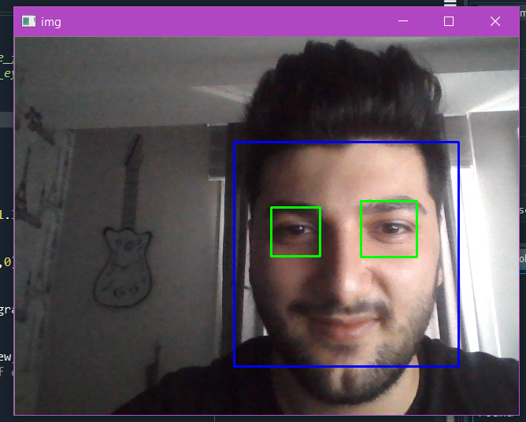

# Dont-sleep-while-driving
Firstly, check my video whose name is "How it works.mp4" in repository or CLICK HERE https://www.linkedin.com/feed/update/urn:li:activity:6666391234493452288/

The main idea of this project give a few attentions when drivers sleep or looking at somewhere instead of road.

You have to download openCV, selenium and twilio.
If you want to get message you have to create twilio account to get twilio number.
https://www.fullstackpython.com/blog/send-sms-text-messages-python.html  that link is going to help you how to use twilio

